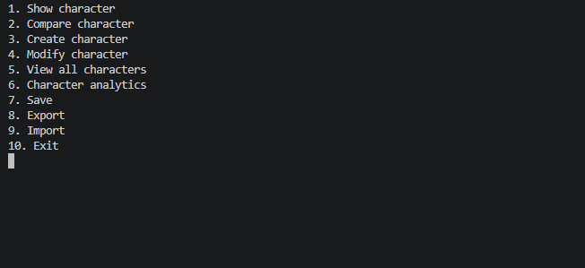

# Upgraded RPG Character Manager
***

A system to create and manage RPG characters allowing saving, random character creation, data analysis, and attribute visualization, among other things.
## Use instructions
***
Prerequisite Python libraries:
- pandas
- matplotlib
- faker
- numpy

Use steps:

1. Install prerequisites
2. Run main.py file
3. Choose option, create character reccomended initially
4. Exit (hopefully choose save first)

## Project features
***
- Character stat visualization
- Visual character comparisons
- Character creation
- Modification of character's inventory, scores, and skills
- Level up functionality
- Simple text multi-character view
- Character class, skill, and score analysis
- Save, import, and export functionality

## License information
***
No copyright

## Contributors
***
- flumph3927